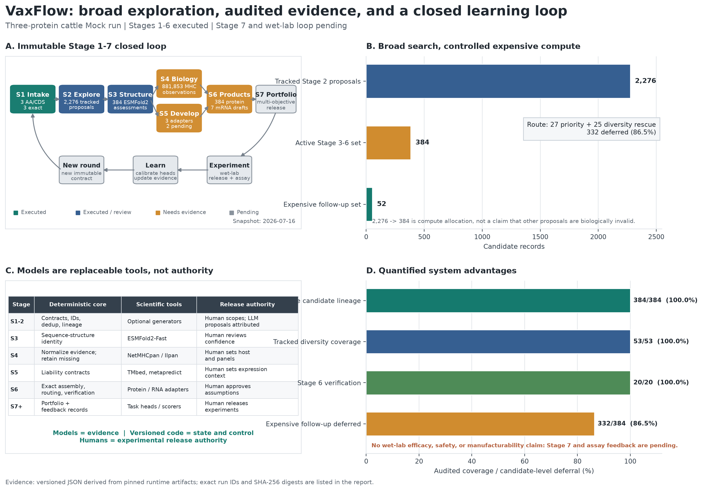

# VaxFlow Stage 1-7 闭环与系统优势报告

日期：2026-07-16
证据快照：`three-protein-vaccine`，牛用亚单位蛋白/mRNA Mock 探索任务

## 结论先行

当前结果已经证明 VaxFlow 不是一组临时脚本，也不是依赖聊天上下文推进的一次性分析，
而是一条具备候选探索、分层计算、证据审计、产品分支、组合排序和实验反馈接口的版本化
工作流：

> 从 3 个经过 AA/CDS 一致性审计的源蛋白出发，系统追踪了 `2,276` 个候选提案，
> 对 `384` 个 active candidates 建立结构、免疫和可开发性证据，生成 `384` 个蛋白产品
> 草案和 `7` 个 mRNA/CDS 控制记录，并把昂贵模型复核范围确定性地收敛到 `52` 个候选。
> 全部 `384/384` active candidates 保留身份和 lineage，`53/53` 个已定义多样性特征被
> 保留，Stage 6 独立验证 `20/20` 通过。

这证明的是**系统工程优势**，不是疫苗效果：

| 已证明 | 尚未证明 |
| --- | --- |
| 大规模候选可以被枚举、去重、追踪和重算 | 候选在牛体内产生保护性免疫 |
| 模型结果可作为具名证据接入，不会成为隐式裁判 | 预测分数等价于安全性、表达量或保护率 |
| 缺失数据会保持 `not_evaluated`/`needs_data` | 当前草案已经适合合成、生产或动物实验 |
| 昂贵计算可按策略分配，并保留被延后的候选 | `52` 个 follow-up candidates 一定优于其余候选 |
| 后续实验标签有明确的回流位置和不可变 round 机制 | 当前任务已经完成湿实验闭环 |

当前 Stage 1-6 已执行；Stage 7、实验 release、assay ingestion 和 learning loop 尚未执行。

## 闭环总图



四个面板应这样阅读：

- **A - Stage 1-7 闭环。** 绿色/蓝色是已执行节点，橙色是已经计算但仍缺外部证据或
  人工确认的节点，灰色是当前 round 尚未执行的 Stage 7 和实验反馈。
- **B - 候选漏斗。** Stage 2 保留 `2,276` 个可追踪提案，`384` 个进入本轮 active
  结构与证据集合，`52` 个获得昂贵模型复核预算。`2,276 -> 384` 是计算资源分配，
  不是对其余候选的生物学否定。
- **C - 权限边界。** 模型提供证据，版本化代码管理身份、状态和规则，人对课题范围、
  缺失事实和实验 release 负责。LLM 可以提出或审核建议，但不能静默改变正式记录。
- **D - 可量化优势。** 图中的 `100%` 是 lineage、特征覆盖和计算验证覆盖，不是疫苗
  有效率。`86.5%` 是 candidate-level 昂贵 follow-up 延后比例，不是实测 GPU 成本节省。

图由 [版本化证据 JSON](stage-closed-loop-data-20260716.json) 和
[Python 绘图脚本](../../scripts/plot_stage_closed_loop.py) 生成，没有手工把结论写进图片。

## 这套系统究竟是什么

VaxFlow 更接近一个疫苗设计的 **design-build-test-learn operating system**，而不是一个
声称端到端给出最终答案的大模型。它由三层组成：

1. **确定性工作流层。** 管理输入契约、候选 ID、序列 hash、去重、lineage、状态机、
   artifact index、规则版本和独立重算。
2. **可替换科学工具层。** ESMFold2-Fast、NetMHCpan、NetMHCIIpan、TMbed、
   metapredict，以及后续的 Evo 2、mRNABERT、RNA structure 或任务头都通过 adapter
   提供具名证据。替换模型不会改写候选身份和实验历史。
3. **治理与 release 层。** 人负责物种、产品、表达系统、免疫 panel、实验资源和最终
   release。LLM 是高自由度审核员和提案者，但输出必须保留来源，并通过代码契约进入
   正式状态。

这种分层使系统可以同时拥有探索能力和审计能力：模型可以快速变化，正式数据结构、
候选 lineage 和实验记录不会随某个模型版本消失。

## Stage 1-7 的输入、处理和输出

| Stage | 核心问题 | 机器执行 | 当前真实输出 | 当前状态与人工权限 |
| --- | --- | --- | --- | --- |
| 1 Program & intake | 我们要做什么，输入序列是否自洽 | AA/CDS 配对、翻译、QC、冻结 round contract | 3 个源蛋白，`3/3` exact translation | `complete`；人确认课题边界和 searchable variables |
| 2 Candidate exploration | 合理的候选空间有哪些 | 枚举、evidence-guided search、dedup、hash、generator lineage | `2,276` 个 proposal records | 已执行、`needs_human_input`；提案不自动等于科学认可 |
| 3 Structure assessment | 候选是否形成可分析结构 | ESMFold2-Fast、残基 confidence、geometry、boundary analysis | `384` 个结构；9 higher、18 mixed、357 low | 已执行、`needs_human_input`；低 confidence 仍可追踪 |
| 4 Biological evidence | 面向目标宿主的免疫证据如何 | MHC-I/II binding 和结构 surface proxy 标准化 | 384 candidates，`881,853` MHC observations | `needs_data`；host panel 和缺失证据由人批准 |
| 5 Developability | 构建和表达有哪些风险 | disorder、signal peptide、TM topology adapters | 3 个 adapter，`2,462` 个 review liabilities | `needs_data`；aggregation/solubility 尚未评估 |
| 6A Protein product | 如何形成重组蛋白产品草案 | antigen/product 分离、表达添加、exact CDS audit、routing | `384` protein drafts；6 个有 exact CDS | `needs_data`；CHO/构建假设必须版本化 |
| 6B mRNA product | 如何形成翻译一致的 mRNA 产品 | source CDS controls、同义设计契约、motif/GC/repeat/RNA adapter 接口 | 6 candidates 上 7 个 audited CDS/mRNA controls | `needs_data`；codon/non-coding/delivery facts 不由模型编造 |
| 7 Portfolio | 有限实验预算应该覆盖哪些候选 | hard gates、缺失惩罚、透明贡献、多目标与 diversity portfolio | 当前 round 未生成正式 portfolio | `pending`；人拥有 experiment release 权限 |
| Experiment & learn | 哪些预测与真实结果一致 | assay schema、标签摄取、校准任务头、误差分析 | 尚无 wet-lab labels | `not_started`；回流后创建新 immutable round |

Stage 7 不是把全部信息压成一个看似精确的神秘总分。它需要保留 hard constraints、
多目标 trade-off、controls 和 diversity，并把每个 feature contribution 与缺失 evidence
暴露出来。最终送实验的是 portfolio，不是单一“冠军”。

## 本轮候选是如何收敛的

### Stage 2 探索来源

| Generator | Candidate records |
| --- | ---: |
| Evidence-guided multifamily search | 2,048 |
| Deterministic combinatorial enumerator | 183 |
| Evidence-guided boundary search | 36 |
| Manual import | 6 |
| Source intake | 3 |
| **Total** | **2,276** |

候选类型为 `2,233` 个 fusion、`40` 个 truncation 和 `3` 个 source controls。这个数量
不是“所有理论可能序列”，而是当前 versioned grammar、变量范围、证据和计算预算下的
完整可审计池。扩大边界、linker、mutation、外部生成模型或产品约束会产生新的 round
和新的候选池，不会偷偷覆盖本轮结果。

### Stage 3-5 active evidence set

本轮对 `384` 个候选执行了结构 assessment。Stage 4 对同一 `384/384` 集合产生
`881,853` 个 MHC observations；Stage 5 对同一集合接入 3 个可用 adapter。候选 ID、
序列和结构结果通过 hash 绑定，因此不会出现“模型算的是 A，报告写成 B”的无声错位。

Stage 3 confidence bands 为：

| Band | Candidates |
| --- | ---: |
| Higher confidence | 9 |
| Mixed confidence | 18 |
| Low confidence | 357 |

该分布表明当前大部分探索性 fusion 的结构证据较弱。系统没有把 low confidence 隐藏成
成功，也没有据此自动宣称候选失效；它把该事实用于 review 和后续计算路由。

### Stage 6 多保真路由

| Lane | Candidates | 含义 |
| --- | ---: | --- |
| `priority` | 27 | 按版本化策略进入优先 follow-up |
| `diversity_rescue` | 25 | 保留 controls 和尚未覆盖的结构/组成/linker 特征 |
| `archive` | 332 | 保留 lineage 和已有证据，本轮延后昂贵复核 |
| **Active total** | **384** | 三条 lane 完整覆盖，不删除候选 |

因此：

```text
expensive follow-up = 27 + 25 = 52
candidate-level deferral = 332 / 384 = 86.46%
tracked diversity coverage = 53 / 53 = 100%
```

`archive` 是预算状态，不是科学淘汰。新证据、新政策或新实验预算可以在下一 immutable
round 中重新路由这些候选。

## 可量化的系统优势

| 优势 | 审计值 | 可以支持的结论 | 不能支持的结论 |
| --- | ---: | --- | --- |
| Search breadth | 2,276 tracked proposals | 系统能扩大并记录设计空间 | 比人工候选更有效 |
| Active lineage coverage | `384/384` | 每个 active candidate 可追溯、可重算 | 每个候选都值得实验 |
| Diversity preservation | `53/53` | 预算收缩没有丢掉已定义特征族 | 未定义的生物学多样性也被覆盖 |
| Stage 6 verification | `20/20`, 0 errors/warnings | 当前 artifact 内部一致 | 科学假设已经正确 |
| Expensive follow-up deferral | `332/384 = 86.5%` | 可把昂贵模型集中到 52 个候选 | 实测节省 86.5% GPU 小时 |
| Biological evidence scale | 881,853 MHC observations | 大批量 adapter 已接入同一 lineage | MHC binding 等价于免疫保护 |
| Product branching | 384 protein drafts、7 mRNA controls | 同一 antigen lineage 可进入两类产品路径 | 这些草案已经 release-ready |

报告没有把这些异质指标归一化后制造一个“系统总分”。它们的分母、意义和证据强度不同，
必须分别解释。

## 相比其他工作方式，我们的优势在哪里

### 相比手工维护固定方案

- 候选空间可以系统枚举和扩展，而不是只保留最后几条人工序列。
- 每个候选都记录来源、规则、父候选、序列 hash 和生成器。
- 人工方案可以作为 control/manual import 进入同一个评价协议，不享受隐式特权，也不会
  被系统丢失。

优势是更广、更一致、更可回溯，不是当前已经证明机器设计比专家设计更有效。

### 相比一个端到端“大模型裁判”

- ESMFold2、MHC predictors、developability tools、Evo 2 和 mRNABERT 各自只回答自己
  能回答的问题。
- 单个工具失败或升级时可以替换 adapter，候选身份、其他证据和历史 round 保持不变。
- 缺失事实不会被模型置信度掩盖；`not_evaluated` 是合法且可见的状态。
- 最终 release 权限不交给任何一个模型或一个不透明 composite score。

优势是故障隔离和证据可解释，不是模型数量越多结论就自动越正确。

### 相比把全部候选送入昂贵模型

- 低成本 draft 和 identity audit 覆盖全部 active candidates。
- priority + diversity rescue 把本轮昂贵 follow-up 从 384 个候选收敛到 52 个，同时覆盖
  53/53 个已定义 diversity features。
- archive 记录仍然存在，后续可重新激活。

优势是 multi-fidelity compute allocation。当前 `86.5%` 是候选数比例；只有记录实际
模型时长和费用后，才能给出真实成本节省。

### 相比依赖 ChatGPT/Agent 临场推进

- 输入、规则、运行、报告、hash 和状态由代码生成，可离线复现。
- LLM 可以发现新问题、提出候选和审核异常，但必须保留 attribution，并通过 schema 和
  verifier 接入。
- 同一 artifact 用独立命令可以重算 20 个 Stage 6 语义检查。
- 新判断进入新版本或新 round，不修改过去记录以配合当前叙事。

优势是系统不会因为换一个 Agent、丢失聊天记录或更换模型而失去可解释性。

## 模型在闭环中的正确位置

| 模型/工具 | 当前职责 | 是否拥有 release 权限 | 本轮状态 |
| --- | --- | --- | --- |
| ESMFold2-Fast | Stage 3 结构与 confidence evidence；Stage 6 变更构建复核接口 | 否 | Stage 3 已执行；Stage 6 follow-up 待补 |
| NetMHCpan / NetMHCIIpan | 牛 MHC-I/II peptide binding evidence | 否 | 已执行，仍缺完整宿主/证据语境 |
| TMbed / metapredict | 跨膜、信号肽、无序风险 evidence | 否 | 已执行 |
| Evo 2 | Stage 6B nucleotide sequence evidence/候选 follow-up adapter | 否 | 当前 routed round 未提供结果 |
| mRNABERT | 蛋白固定后 mRNA/codon 产品设计与评分 adapter | 否 | 当前 routed round 未提供结果 |
| RNA structure predictor | Stage 6B RNA constraint/evidence adapter | 否 | 当前 routed round 未提供结果 |
| Downstream task heads | 湿实验标签到位后的项目/assay-specific calibration | 否 | 尚无标签，未训练 |

这也是为什么“部署了模型”不等于“模型已经参与本轮证据”。只有 checksum-bound 输出被
adapter 导入、通过 identity 和 schema 校验后，报告才会将其标记为 evaluated。

## 为什么这叫闭环，而当前又还没有真正闭环

完整闭环是：

```text
Stage 1 contract
  -> Stage 2 exploration
  -> Stage 3-5 multi-fidelity evidence
  -> Stage 6 product realization
  -> Stage 7 portfolio release
  -> wet-lab assays
  -> label ingestion and calibrated task heads
  -> new immutable Stage 1 round
```

架构和代码路径已经覆盖这个循环，但当前 evidence snapshot 只走到 Stage 6。Stage 7 和
wet-lab loop 仍为 pending/not_started，所以准确表述是：

> **闭环架构已经建立，计算前半环已经跑通，实验后半环尚未执行。**

实验数据返回后不能直接覆盖今天的评分。系统应创建新 round，固定 assay schema、标签、
模型 revision 和 calibration 结果，再比较新旧 portfolio。这使一次失败实验也能成为可用
训练信号，而不是只留下无法追溯的口头结论。

## 当前下一道门

Stage 7 之前仍需把以下事实变成版本化输入或明确的 `not_evaluated`：

1. 蛋白和 mRNA 两个产品分支的 product context 与 release policy。
2. mRNA 同义设计需要的目标 context codon table、non-coding elements 和 delivery 假设。
3. 本轮要纳入的 Evo 2、mRNABERT、RNA structure、aggregation 和 solubility evidence。
4. Stage 7 hard gates、feature weights、coverage penalty、controls 和实验预算。

缺少某个可选 adapter 不必阻塞代码运行，但其 feature 不能被伪装成已评估。缺少会影响
产品身份、翻译一致性或实验 release 的事实则必须阻塞正式 portfolio release。

## 可复现证据

### 固定运行

| Node | Run ID | Artifact SHA-256 |
| --- | --- | --- |
| Stage 1 | `20260715T080421641758Z-25cb00ab` | `0d657a87fd73f6bffc10149f9f24fc2771aa5b012f360a2be5feb196bd478706` |
| Stage 2 | `20260715T111408094814Z-stage2-caaef819` | `055506ec799afb24439419a68ddfe8eaa9276c7927239c4773c7fdffbd4fc9a9` |
| Stage 3 | `20260715T153913241225Z-stage3-7d0bd68b` | `d541be99e5427e41ca57a2d564750e2825ef29048c12e06de0d7d7b2890cb529` |
| Stage 4 | `20260716T041527036725Z-stage4-5-aae38adc` | `0966dad5591aa62bc85d2b8bbebf262f5ce89fbd325d2349e41f7127281f96b8` |
| Stage 5 | `20260716T041527036725Z-stage4-5-aae38adc` | `528ad2da3a3e0dc031d66e92430cd1cff2e6ead9d3f67ff905a5a21be3d8f891` |
| Stage 6 protein | `20260716T060350582289Z-stage6-29403999` | `33d64f3d53fcc519fd134b94c67f8431ee34222b6ed92b9dcf02d8e9ad670e79` |
| Stage 6 mRNA | `20260716T060350582289Z-stage6-29403999` | `9b5f870ee05f18ffebbc7101e3b4e395f9d2a9841c20411178e87969f2b352a2` |
| Stage 6 routing | `9033b05c23176138c6658e5964c3e37ac3f601b90cf5164864901a4e0ed5cb3a` | `663409d9bc7f5990fec58900b0ca4ee534a08ee0cdd9dd35022b51c22ab399d7` |

Workflow contract SHA-256：
`a5e858dba9ae2c4d480f9c2b1661ed79138211f4e5e99157dce3b1f6aef30b0c`。

### 重绘命令

在安装了 Matplotlib 的 Python 环境中运行：

```bash
python design-flow/scripts/plot_stage_closed_loop.py
```

脚本会校验 schema、Stage 2 数量守恒、Stage 3 band coverage、Stage 4/5 lineage、Stage 6
routing partition、diversity coverage、verification、Stage 7 pending 状态以及全部 artifact
hash 格式，然后同时生成 PNG 和 SVG。任一关键数字不一致时会失败，而不是继续生成一张
看似正常的图。

## 对外可使用的准确表述

建议使用：

> 我们已经建立一条可复现的多模型疫苗设计工作流。它把候选探索、结构/免疫/可开发性
> 证据、蛋白与 mRNA 产品设计、多目标组合选择和实验反馈放在同一条版本化 lineage 中。
> 当前三蛋白 Mock run 从 2,276 个可追踪提案形成 384 个 active candidates，并通过
> 多保真路由把昂贵 follow-up 集中到 52 个，同时保留全部 active lineage 和已定义
> diversity coverage。现阶段证明的是计算流程、审计和资源分配能力；保护效果、安全性和
> 可制造性仍需 Stage 7 release 与湿实验验证。

不建议使用：

- “系统已经设计出有效疫苗”；
- “384 个候选全部通过科学验证”；
- “机器候选已证明优于人工候选”；
- “节省了 86.5% GPU 成本”；
- “Stage 1-7 和湿实验闭环已全部完成”。

这些表述超出了当前证据。
