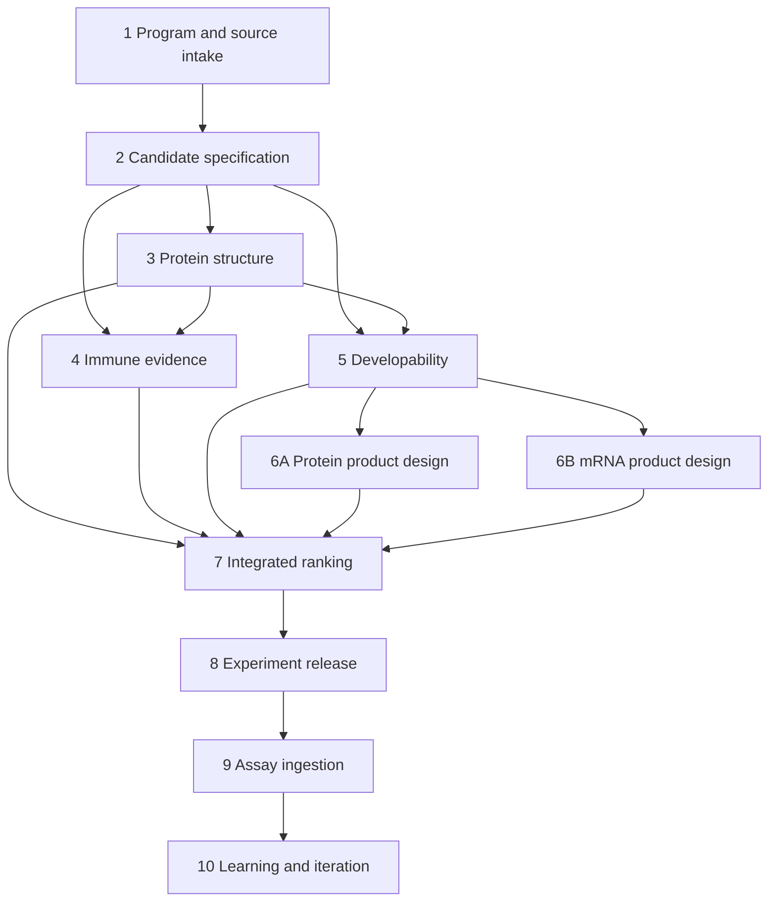

# Vaccine Design Workflow v1

Status: frozen baseline

- System architecture version: `1`
- Workflow ID: `vaccine-design-build-test-learn`
- Workflow version: `1`
- Entry stage: `program_and_source_intake`
- Contract SHA-256: `0c2f4fff63cddcf3ea2851b0501db7dff61ca8a93eea7bf93b0b09a4dc709763`
- Executable source: `src/design_flow/workflow.py`
- Frozen machine contract: `docs/workflow-v1.json`

This document fixes the intended system route so later implementation cannot
silently replace the product question or reorder evidence around whichever model
is currently convenient. The Python contract is the executable source of truth;
the checked-in JSON is its exact reviewable snapshot; this document explains the
meaning and change policy.

## Objective

Starting from source proteins and coding sequences, produce a traceable portfolio
of recombinant-protein and mRNA vaccine candidates, release selected candidates
to controlled experiments, ingest assay evidence, and learn task-specific ranking
models for the next immutable design round.

The workflow produces computational evidence and decision records. It does not
equate a model score with vaccine safety or efficacy.

## Canonical DAG

The graph has one entry and one terminal stage. The two product branches rejoin
before portfolio selection. Learning starts a new run at candidate specification;
it does not mutate an earlier run or create a cycle inside one run.

## Stage Responsibilities

| Order | Stage ID | Required input | Primary processing | Released output | Human authority |
|---|---|---|---|---|---|
| 1 | `program_and_source_intake` | Project context, source AA/CDS, provenance | Identity, translation, syntax, descriptors, source hashing | Accepted source candidates, findings, unresolved actions | Approve source controls and resolve disputed identity |
| 2 | `candidate_specification` | Released sources, manual constructs, construct grammar | Enumerate originals, truncations, fusions, linkers, tags, and lineage | Frozen candidate batch with exact component maps | Approve design space, boundaries, linkers, tags, and controls |
| 3 | `protein_structure_assessment` | Candidate batch, chain and oligomer assumptions | Pinned structure prediction and geometry comparison | Structure artifacts, confidence, domain/interface findings | Review low-confidence geometry and structural exceptions |
| 4 | `immune_evidence_assessment` | Candidates, structures, pathogen panel, host assumptions | Conservation, presentation, accessibility, similarity, and uncertainty evidence | Residue-level immune-evidence records | Approve host assumptions and which evidence may gate |
| 5 | `developability_assessment` | Candidates, structures, expression and product assumptions | Solubility, aggregation, topology, disorder, stability, and liability checks | Versioned liabilities, hard constraints, optimization features | Decide expression assumptions and mitigable risks |
| 6A | `protein_product_design` | Accepted antigen lineage and expression constraints | Add declared expression components and host-compatible coding construct | Exact recombinant-protein release specification | Approve host, vector, tags, cleavage, and purification choices |
| 6B | `mrna_product_design` | Accepted antigen AA and mRNA platform constraints | Synonymous design under codon, motif, GC, repeat, and RNA constraints | Translation-preserving mRNA Pareto candidates | Approve species, cell, UTR, poly(A), delivery, and synthesis assumptions |
| 7 | `integrated_ranking` | All released evidence and ranking policy | Hard gates, transparent multi-objective ranking, uncertainty and diversity | Ranked portfolio with controls, exclusions, and sensitivity | Approve policy, budget, risk tolerance, and selected portfolio |
| 8 | `experiment_release` | Selected portfolio and assay plan | Blind IDs, controls, replicates, randomization, checksums, release freeze | Immutable experimental release package | Scientific, laboratory, safety, and quality sign-off |
| 9 | `assay_ingestion` | Raw files, metadata, sample mapping, units, protocols | Immutable ingestion, versioned transforms, assay QC, controlled unblinding | Frozen analysis dataset with raw-data lineage | Adjudicate controls, deviations, censoring, and exclusions |
| 10 | `learning_and_iteration` | Frozen labels, split policy, batch and endpoint metadata | Baselines, task heads, calibration, ablation, active-learning policy | Evaluated model version and next-round proposal | Approve labels, promotion thresholds, and next design round |

The complete per-stage capability, input-audit, process, output-audit, human-action,
and dependency contracts are normative in `workflow-v1.json`.

## Cross-Cutting Invariants

Every implemented stage must preserve these properties:

1. Inputs are immutable snapshots or checksum-addressed references.
2. Every candidate and physical sample has a stable identity.
3. A sequence change creates a child candidate; no stage silently rewrites a parent.
4. Raw outputs remain available beside normalized features and conclusions.
5. Tool, model, database, code, parameters, seeds, and hardware are recorded where applicable.
6. `fail`, `warning`, `not_evaluated`, and execution `error` remain distinct.
7. LLM findings, deterministic findings, model predictions, and human decisions have separate provenance.
8. An LLM may propose a finding but cannot approve a hard gate or experimental release.
9. Open actions carry forward until resolved, rejected, or explicitly waived by an authorized owner.
10. Corrections produce a new run or versioned attempt; prior evidence is not overwritten.

## Implementation Boundary

At workflow v1 baseline time, only `program_and_source_intake` is executable. Its
sequence checks, candidate identities, artifact index, handoff, and HTML report are
implemented and tested. The remaining ten nodes are contracts and planned
adapters; their presence in the DAG means `not_evaluated`, not completed.

The current project-specific archive review also contains configured LLM/human
findings that are reproducible from `project.json` but are not all automatically
rediscovered from raw files. The exact boundary is documented in
`audit-automation-and-llm-governance.md`.

## Change Control

The workflow may not be changed by editing only prose or only code.

A semantic change to a stage, dependency, gate, or audit contract requires:

1. a new ADR describing the reason and migration impact;
2. incrementing `WORKFLOW_VERSION` in `workflow.py`;
3. creating a new `workflow-vN.json` and `workflow-vN.md` rather than rewriting
   this frozen v1 baseline;
4. updating the architecture version when system authority or provenance
   boundaries change;
5. updating DAG, contract, verifier, and migration tests;
6. defining how active and historical runs are interpreted;
7. regenerating reports only in new immutable runs.

Non-semantic corrections may clarify this document, but must not change the
machine contract, contract hash, or meaning of an existing run.

Tests must fail when the executable contract differs from the frozen JSON or when
this document records the wrong architecture version, workflow version, or hash.
