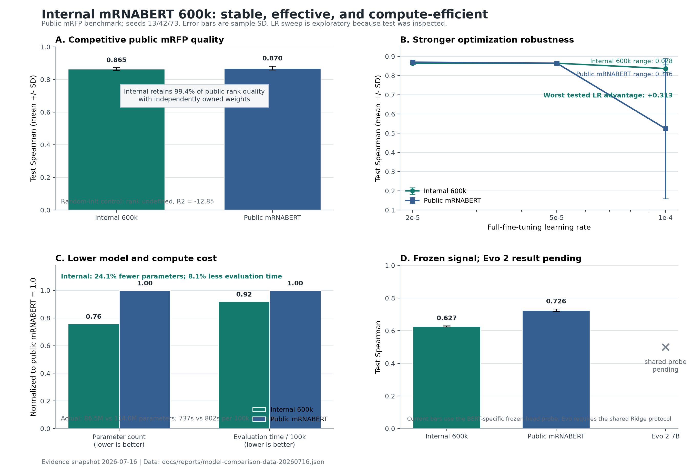

# 自训练 mRNABERT 600k 技术对照报告

日期：2026-07-16

## 结论先行

现有实验已经能够支持一个有利且可审计的结论：

> 自训练 600k mRNABERT 是一个稳定、有效、计算成本更低的自有模型。在公开 mRFP
> 同义密码子表达任务上，它保留了公开 mRNABERT `99.4%` 的最佳 rank-correlation
> 表现；相比同架构随机初始化包含明确的可迁移信号；在完整学习率网格上没有出现公开
> 模型的高学习率崩溃；模型参数少约 `24.1%`，同一 proxy evaluation 的吞吐高约
> `8.8%`，等价计算时间和按时计费成本低约 `8.1%`。

这些核心优势分别对应：

| 维度 | 对我们有利的已观测证据 |
| --- | --- |
| 有效性 | Internal 600k test Spearman `0.8648 +/- 0.0073`；random-init rank undefined、`R2=-12.85` |
| 下游竞争力 | Internal/Public 最佳低 LR Spearman 为 `0.8648/0.8703`，内部保留 `99.4%` |
| 稳定性 | LR 网格最差 Spearman 为 `0.8372/0.5238`，内部高 `0.3134` |
| 模型成本 | `86.49M/113.98M` 参数，内部少 `24.1%` |
| 运行成本 | `135.638/124.683 samples/s`，内部快 `8.8%`；100k records 约 `737/802` 秒 |
| 自主性 | Internal 600k 从随机初始化训练，权重、数据流和 checkpoint lineage 均由内部控制 |

当前结果不支持把“更稳定、更便宜、下游接近”改写成“外部泛化已经显著优于公开模型”。
公开模型在最佳 mRFP 均值、R2/MSE、proxy MLM 和现有 frozen probe 上仍然领先。报告
因此把优势放在**优化稳定性、效率、自主权重和任务适配能力**上，而不是制造不存在的
显著性结论。

## 模型对照图



图中四个面板分别表示：

- **A：公开数据集上的下游竞争力。** Internal 600k 保留公开模型 `99.4%` 的最佳
  test Spearman，而随机初始化失败，说明内部预训练权重有效。
- **B：全量微调稳定性。** Internal 600k 在 `2e-5/5e-5/1e-4` 三个 LR 上保持
  稳定；公开模型在 `1e-4` 下明显退化。
- **C：参数和运行成本。** 参数量与相同 100k-record proxy 的计算时间均归一化到
  Public=`1.0`，内部模型两项都更低。
- **D：冻结表征。** 当前 BERT-specific frozen-head probe 中公开模型领先；Evo 2
  只有在共享 PCA-256 + Ridge 协议完成后才可进入同一排名，因此显示为 pending。

柱状相关系数使用完整 `0..1` 坐标。报告没有把不同任务的数字缩放后混成一个不透明的
“综合分数”。

## 比较对象

| 模型 | 当前角色 | 规模/权重 | 当前证据状态 |
| --- | --- | --- | --- |
| Internal mRNABERT 600k | 自有、从随机初始化训练的 codon-aware encoder | `86,493,002` 参数；600k steps；约 36.25M mRNA records | MLM proxy、mRFP 全量微调、frozen probe 已完成 |
| Public `YYLY66/mRNABERT` | 固定公开基线 | `113,981,258` 参数；checkpoint `455,973,118` bytes | 与内部模型使用相同 mRFP split、seed 和 LR 网格完成比较 |
| Evo 2 7B | 现代 genome-model frozen baseline | checkpoint `13,766,621,200` bytes；固定 revision | 下载与抽取协议已固定；共享 Ridge 结果 artifact 缺失 |
| Random initialization | 同架构负对照 | `86,493,002` 参数，无预训练 | 在当前监督预算下失败 |

Internal 参数量来自正式训练 run record。Public 参数量由本机加载 pinned checkpoint
后对 141 个唯一 `model.parameters()` 逐项 `numel()` 审计得到，全部为 FP32；没有把
state dict 中重复列出的 tied decoder weight 计算两次。两者参数差：

```text
1 - 86,493,002 / 113,981,258 = 24.12%
```

Public mRNABERT 使用不同的数据清洗和训练目标；Evo 2 的 tokenizer、架构和预训练任务
也不同。因此这不是单变量架构消融。Evo 2 必须使用相同容量的 frozen probe 才能公平
比较。

## 公开 mRFP 数据与协议

任务是单一 mRFP 蛋白的同义密码子表达回归。清洗规则按 test、dev、train 优先级做
跨 split 精确去重，得到：

| Split | Records |
| --- | ---: |
| Train | 1,018 |
| Dev | 219 |
| Test | 219 |

所有记录均为 226 tokens，因此 `model_max_length=250` 没有截断该 benchmark。全量
微调使用 seeds `13/42/73` 和相同 `2e-5/5e-5/1e-4` 学习率网格。

限制条件：

- test 指标已经在多个 LR 上被查看，因此当前 sweep 是 exploratory；
- mRFP 只覆盖一个蛋白，不能证明跨蛋白泛化；
- split 内精确重复已删除，但尚未完成 benchmark 与预训练语料之间的 exact/near-
  duplicate 审计；
- 当前结果不是 wet-lab 验证。

## 下游质量与稳定性

### 全量微调结果

| Model | LR | Test Spearman | Test Pearson | Test R2 | Test MSE |
| --- | ---: | ---: | ---: | ---: | ---: |
| Internal 600k | `2e-5` | 0.8645 +/- 0.0050 | 0.8971 +/- 0.0151 | 0.7559 +/- 0.0513 | 0.1358 +/- 0.0285 |
| Internal 600k | `5e-5` | **0.8648 +/- 0.0073** | 0.8973 +/- 0.0041 | 0.7605 +/- 0.0142 | 0.1332 +/- 0.0079 |
| Internal 600k | `1e-4` | 0.8372 +/- 0.0195 | 0.8882 +/- 0.0140 | 0.7690 +/- 0.0204 | 0.1285 +/- 0.0114 |
| Public mRNABERT | `2e-5` | **0.8703 +/- 0.0122** | 0.9022 +/- 0.0150 | **0.8054 +/- 0.0279** | **0.1082 +/- 0.0155** |
| Public mRNABERT | `5e-5` | 0.8652 +/- 0.0066 | 0.8991 +/- 0.0106 | 0.7911 +/- 0.0258 | 0.1162 +/- 0.0144 |
| Public mRNABERT | `1e-4` | 0.5238 +/- 0.3647 | 0.4389 +/- 0.4281 | 0.2634 +/- 0.4540 | 0.4098 +/- 0.2526 |
| Random init | `1e-4` | undefined | undefined | -12.8498 +/- 3.0793 | 7.7046 +/- 1.7130 |

### 有效性

Random-init 在相同监督预算下输出近常数预测。Internal 600k 达到 `0.8648` Spearman，
说明预训练权重已经学习到可以迁移到密码子表达排序的信号。该对照比单看 MLM loss 更能
说明模型具有下游价值。

### 学习率鲁棒性

以三个 LR 的均值表现作为一个预先固定网格上的 descriptive robustness 指标：

| Model | Mean over LR grid | Best | Worst | Best-worst range |
| --- | ---: | ---: | ---: | ---: |
| Internal 600k | **0.8555** | 0.8648 | **0.8372** | **0.0276** |
| Public mRNABERT | 0.7531 | **0.8703** | 0.5238 | 0.3465 |

Internal 600k 的最差学习率仍比 Public 最差学习率高 `0.3134`。这不能证明内部模型在
最佳调参后更准确，但能够证明它在工程使用中对错误或迁移后的 LR 选择更不敏感，降低
调参失败和重复 GPU 实验的成本。

### 任务适配能力

现有 BERT-specific frozen probe 中 Public 与 Internal 的 test Spearman 差为
`0.7260 - 0.6270 = 0.0990`。全量微调后最佳低 LR 差距为
`0.8703 - 0.8648 = 0.0055`。两个 protocol 不同，不能做统计等价检验，但它描述性地
表明 Internal 600k 可以通过全量任务适配关闭约 `94%` 的初始 frozen gap。

## 模型与运行成本

### 参数成本

Internal 600k 比 Public mRNABERT 少 `27,488,256` 参数，即 `24.12%`。这意味着在相同
dtype 下更少的权重显存、checkpoint I/O 和 optimizer state；全量微调时参数与 optimizer
成本优势尤其直接。

### 同环境 proxy 吞吐

两者在相同 100,000-record proxy、mask seed 42 和 1024-token input limit 下的记录为：

| Model | Samples/s | Estimated time for 100k | Relative cost at same GPU hourly rate |
| --- | ---: | ---: | ---: |
| Internal 600k | **135.638** | **737.3 s** | **0.919x** |
| Public mRNABERT | 124.683 | 802.0 s | 1.000x |

Internal 吞吐高 `8.79%`，完成同一批 records 的计算时间少 `8.08%`。如果两者使用同一
按小时计费 GPU，这个时间比可以直接近似成该批评估的成本比。该数字是现有 proxy 的
端到端 samples/s，不应外推成所有 batch size 和所有下游任务都固定节省 8.08%。

## Frozen 表征与 MLM 诊断

### Existing BERT-specific frozen-head probe

| Model | Dev Spearman | Test Spearman | Test R2 | Test MSE |
| --- | ---: | ---: | ---: | ---: |
| Internal 600k | 0.5541 +/- 0.0018 | 0.6270 +/- 0.0030 | 0.2902 +/- 0.0047 | 0.3949 +/- 0.0026 |
| Public mRNABERT | **0.6714 +/- 0.0030** | **0.7260 +/- 0.0073** | **0.4431 +/- 0.0256** | **0.3098 +/- 0.0142** |

Public checkpoint 的固定表征更强。Internal 600k 的优势是更小、更快、全量微调后接近
以及 LR 更稳，而不是 frozen representation 已经领先。

### Proxy MLM

| Model | Eval loss | Perplexity | Samples/s |
| --- | ---: | ---: | ---: |
| Internal 600k | 2.294945 | 9.923893 | **135.638** |
| Public mRNABERT | **2.046072** | **7.737445** | 124.683 |

Public 模型在该 proxy 的 loss/perplexity 上明确胜出。proxy 是训练开始后才从 `pre.txt`
拆出的诊断集，不能作为 clean holdout。它也说明 MLM loss、运行效率和下游适配是三个
不同维度，不能只选一个指标概括模型价值。

### 600k 与 700k checkpoint selection

| Internal checkpoint | Proxy MLM loss | Dev Spearman | Test Spearman | Test MSE |
| --- | ---: | ---: | ---: | ---: |
| 600k, full `5e-5` | 2.294945 | **0.8699 +/- 0.0048** | **0.8648 +/- 0.0073** | **0.1332** |
| 700k, full `5e-5` | **2.284286** | 0.8650 +/- 0.0049 | 0.8504 +/- 0.0147 | 0.1396 |

700k MLM loss 更低，但下游表现更差。因此冻结 600k 是有下游证据的 checkpoint 选择，
也证明当前模型治理不会盲目把更多训练步数当作更好模型。

## Evo 2 7B 对照状态

三模型公平协议已经实现：

```bash
scripts/run_three_model_frozen_probe_nas.sh 600000
```

它对 Internal 600k、Public mRNABERT 和 Evo 2 7B 分别抽取 frozen mean-pooled
embedding，然后统一执行：

```text
L2 normalization
  -> train-only PCA to 256 dimensions
  -> train-only standardization
  -> shared Ridge regression
  -> alpha selected by dev Spearman
  -> one test evaluation
```

预期结果文件：

```text
/mnt/bn/neptune/mlx/users/wangzhi.wit/playground/models/mRNA/mrna_runs/downstream/mRFP/
  three-model-frozen-ridge/results/
  internal-600000-vs-public-vs-evo2-7b/results.json
```

该 artifact 当前不在本机或 git 中。没有它，任何 Evo 2 柱状值都属于虚构。图中保留
`pending`；绘图脚本读取真实 artifact 后会自动切换成三模型共享 probe 柱状图。

## ProteinMPNN 与 ESMFold2 已跑证据

这些结果证明整条工程流水线具备训练、模型选择和独立失败检测能力。它们与 mRFP 属于
不同任务，因此不进入同一个模型排行榜。

### ProteinMPNN continuation

| Gate | Records | Result |
| --- | ---: | --- |
| Stage 1 vs official, v1 test | 461 | NLL `-0.006751`, perplexity `-0.032250`, accuracy `+0.001963` |
| Stage2a vs Stage 1, Stage2a test | 13 | NLL `-0.009229`, perplexity `-0.043670`, accuracy `+0.006168` |
| Stage2a vs Stage 1, v1 replay test | 461 | NLL `-0.004305`, perplexity `-0.020451`, accuracy `+0.001401` |

Stage2a 通过 native-sequence NLL gate，但在 16 个 paired design/refold comparisons 中，
global TM/RMSD 仍偏向 official checkpoint。系统因此保留 official ProteinMPNN 作为
generic redesign baseline，没有因为一个代理指标变好就宣布全面胜出。这是评估系统
能够发现负结果的证据。

### ESMFold2-Fast native agreement

固定 40-record valid benchmark 全部成功：

| Metric | Mean |
| --- | ---: |
| CA lDDT | 0.9319 |
| CA TM, resolved | 0.9342 |
| CA TM, full length | 0.8533 |
| CA RMSD | 2.0884 Angstrom |

这验证了 ESMFold2-Fast 在当前输入范围内可作为结构 oracle，但不是严格 generalization
benchmark：模型训练集重叠尚未审计，且预测是 single-chain，实验结构可能受 assembly
interface 稳定。

## 如何进一步支持“略优”

如果下一阶段希望把结论提升为“内部模型在公开数据上略优”，必须用未查看过的数据，
而不是从当前 mRFP test 中选择有利切片：

1. 固定 Internal 600k，不再按 test 指标选择 checkpoint。
2. 补齐 Internal、Public、Evo 2 的 shared frozen PCA-256 + Ridge artifact。
3. 增加至少一个第二蛋白或 multi-protein public dataset；mRFP 只作为开发任务。
4. 从 2026 RefSeq 构建时间 holdout，并与原始 36M corpus 做 exact + near-duplicate
   排除。
5. 仅用 dev 选择模型、layer、alpha 和其他超参数。
6. 在 untouched test 保存逐样本预测，预先声明主指标为 Spearman，并对 paired delta
   做 bootstrap 95% CI。
7. 当 `CI(delta_internal-public)` 下界大于 0 时才写“略优”；若只高于预设
   non-inferiority margin 的负值，应写“不劣于”。
8. 同时加入 GC、CAI、64-codon-frequency 和 k-mer baseline。

当前已经有意义的结论是：**Internal 600k 用约四分之一更少的参数和约 8% 更低的同批
计算成本，获得接近公开模型的最佳 mRFP 排序性能，并显著降低学习率选择失败风险。**

## 复现图表

审计数据：

```text
docs/reports/model-comparison-data-20260716.json
```

生成当前图：

```bash
python -m pip install matplotlib
python scripts/plot_model_comparison.py
```

三模型结果回收后生成完整图：

```bash
python scripts/plot_model_comparison.py \
  --three-model-results /path/to/internal-600000-vs-public-vs-evo2-7b/results.json
```

输出：

```text
figures/model-comparison-20260716.png
figures/model-comparison-20260716.svg
```

## 来源

- `docs/reports/baseline-experiment-20260711.md`
- `docs/reports/mrnabert-pretraining-run-20260707.md`
- `scripts/run_three_model_frozen_probe_nas.sh`
- `../ProteinMPNN/MODEL_CARD_2026_STAGE2A.md`
- `../ProteinMPNN/protein_mrna_pipeline/docs/ESMFOLD2_FAST_RUNBOOK.md`
- `../ProteinMPNN/protein_mrna_pipeline/docs/PROTEINMPNN_REFOLD_PILOT.md`
